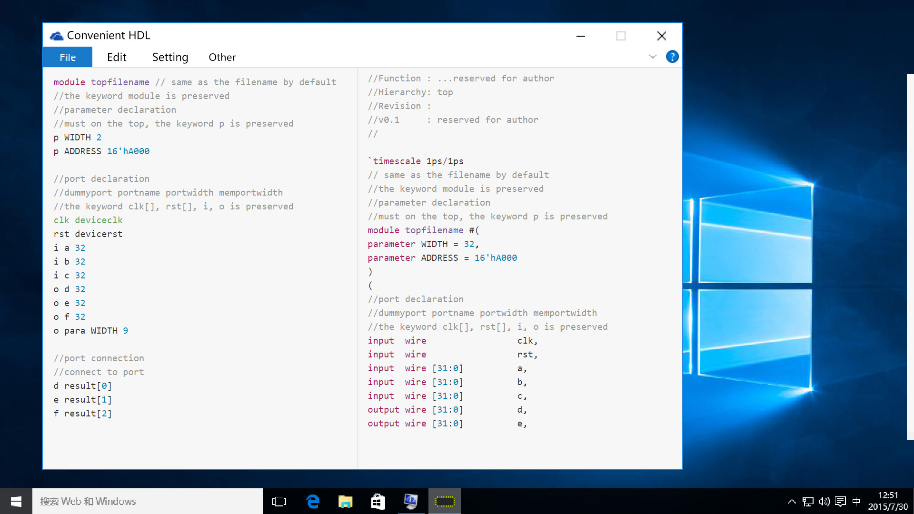

<!-- Readme File of Convenient Hardware Description Language -->
##Convenient Coding HDL

###Function Description
Provide easily used function for verilog.

* Converts Convenient Coding Verilog (.ccv) into Verilog (.v) to generate top module file rapidly. Automatically get children's port descriptions from Verilog 1995, Verilog 2001, Verilog 2005(ports conversion), VHDL. For IP cores, only port description file is needed. Users may write serveral IPs' ports descriptions in one file.

* Change the port format of Verilog File between Verilog 1995, Verilog 2001 and Verilog 2005. Clear or add annotations or port direction descriptions. Merge or split Verilog files.

* Prints out the project hierarchy.

* Provides basic circuits check and automatically fix the potential grammar problem.

###Argument Parsing

* --init (filepath) :: (initial) Create a project tree for the files under filepath recursively. If no filepath is specified, then use current directory by default.

* --email [emailaddress] :: (email) Set default contact e-mail address for file header. Default is null(""), which won't be shown out in file header.

* --author [authorname] :: (author) Set default user name for file header.  Default is null(""), which won't be shown out in file header.

<!--     Scans the root path, if multiple top module found, user have to select the top file manually.
    If there exists a previous project file .ccv.project. This file will be updated. -->

* --update (filepath) :: (update) Update current project hierarchy. Current directory is used by default.

* -n (filename) :: (new) Create a normal new verilog file with module frame description and right claimation. "a.v" is used by default. If filename has exist, choice box will prompt. The Revision number is set to v0.1 automatically. 

```Verilog
//
//Filename : filename
//Author   : authorname
//Contact  : emailaddress
//Function : ...reserved for author
//Hierarchy: cell
//Revision :
//v0.1     : reserved for author
//

`timescale 1ps/1ps
module filename #(
)
(
    input  wire             clk,
    input  wire             rst
);

endmodule
```

* -t [topfilename] [filepath] :: (top) Automaticlly generate a top module from elementary cells.

    There are two ways to generate a top file:

    If there is a file with the same name as topfilename ends with file extension name (ccv), then a "topefilename.v" is generated according to "topfilename.ccv".

    -If the parameter of the instantied module is the same as the topfilename module, ccv would automatically connect them, otherwise the value from child module fills it. 

    -If the clock and reset ports are the same as the topfilename module, and -a option is checked, ccv would automatically connect them. Otherwise user may have to set the clk manually, or leave ports unconnected.

* -d :: (desciption) Preserves annotions and port descriptions in child module. If not specified, no annotion is provided.

* -a :: (automatic) Automatically connects the ports of top module and instatitaed module with the same name as instatitaed modules. If not specified, all ports will be left unconnected.

* -p :: (ports) Provides port directions.

A typical ccv(Convenient Coding for Verilog) file is shown below:
```Verilog
module topfilename // same as the filename by default
//the keyword module is preserved
//parameter declaration
//must on the top, the keyword p is preserved
p WIDTH 2
p ADDRESS 16'hA000
    
//port declaration
//dummyport portname portwidth memportwidth
//the keyword clk[], rst[], i, o is preserved
clk deviceclk
rst devicerst
i a 32
i b 32
i c 32
o d 32
o e 32
o f 32
o para WIDTH 9

//port connection
//connect to port
d result[0]
e result[1]
f result[2]

//module instantiation
moduleA nameA
    clk usrclk
    ~rst nreset

moduleB nameB
    alpha port1
    beta port2
    gama port3

//Automatically generate a memtype wire
//Descripted in normal wire
moduleC nameCalpha
    alpha in
    signal[0] out

moduleC nameCbeta
    alpha in
    signal[1] out

moduleC nameCgama
    alpha in
    signal[2] out

//generate duplicated instance all expanded
//the keyword duplicate is preserved
duplicate moduleD nameD 3 nogen
    clk calcclk
    rst calcrst
    signal[] in[]
    result[] out[]

//generate duplicated instance with gen grammar
duplicate moduleE nameE 9 gen
    clk clk
    ~rst nrst
    para[] paravec

```

The corresponding Coverted Verilog file is shown below:
```Verilog
//
//Filename : topfilename
//Author   : authorname
//Contact  : emailaddress
//Function : ...reserved for author
//Hierarchy: top
//Revision :
//v0.1     : reserved for author
//

`timescale 1ps/1ps
// same as the filename by default
//the keyword module is preserved
//parameter declaration
//must on the top, the keyword p is preserved
module topfilename #(
parameter WIDTH = 32,
parameter ADDRESS = 16'hA000
)
(
//port declaration
//dummyport portname portwidth memportwidth
//the keyword clk[], rst[], i, o is preserved
input  wire                 clk,
input  wire                 rst,
input  wire [31:0]          a,
input  wire [31:0]          b,
input  wire [31:0]          c,
output wire [31:0]          d,
output wire [31:0]          e,
output wire [31:0]          f,
output wire [WIDTH*9-1:0]   para,
output wire                 feedback
);

//Wire declaration
wire [31:0]     alpha;
wire [31:0]     beta;
wire [31:0]     gama;
wire [32*3-1:0] result;
wire [32*3-1:0] signal;

//port connection
//connect to port
assign d = result[32*0+:32];
assign e = result[32*1+:32];
assign f = result[32*2+:32];

//module instantiation
moduleA #(
.TIMEUNIT(16),
.WIDTH(WIDTH),
.ARRAYNUM(4)
)
nameA
(
.usrclk(deviceclk),  //i
.nreset(~devicerst), //o
.a(a),  //i
.b(b),  //i
.c(c),  //i
.alpha(alpha),  //o
.beta(beta),  //o
.gama(gama),  //o
.feedback(feedback),  //o
.start(start),  //o
.stop(stop),  //o
.pause(pause)  //o
);

moduleB #(
.WIDTH(WIDTH),
.ADDRESS(ADDRESS)
)
nameB
(
.deviceclk(deviceclk),
.devicerst(devicerst),
.port1(alpha),
.port2(beta),
.port3(gama),
.start(start),
.stop(stop),
.pause(pause)
);


//Automatically generate a memtype wire
//Descripted in normal wire
moduleC #(
.WIDTH(WIDTH),
)
nameCalpha
(
.clk(deviceclk),
.rst(devicerst),
.in(alpha),
.out(signal[32*0+:32])
);

moduleC #(
.WIDTH(WIDTH),
)
nameCbeta
(
.clk(deviceclk),
.rst(devicerst),
.in(beta),
.out(signal[32*1+:32])
);

moduleC #(
.WIDTH(WIDTH),
)
nameCgama
(
.clk(deviceclk),
.rst(devicerst),
.in(gama),
.out(signal[32*2+:32])
);

//generate duplicated instance all expanded
//the keyword duplicate is preserved
moduleD #(
.WIDTH(WIDTH),
)
nameD0
(
.clk(deviceclk),
.rst(devicerst),
.in(signal[32*0+:32]),
.out(result[32*0+:32])
);

moduleD #(
.WIDTH(WIDTH),
)
nameD1
(
.clk(deviceclk),
.rst(devicerst),
.in(signal[32*1+:32]),
.out(result[32*1+:32])
);

moduleD #(
.WIDTH(WIDTH),
)
nameD2
(
.clk(deviceclk),
.rst(devicerst),
.in(signal[32*2+:32]),
.out(result[32*2+:32])
);

//generate duplicated instance with gen grammar
generate
genvar i;

for (i = 0; i < 9; i = i + 1)
begin:nameEgenblk

moduleE #(
)
nameE
(
.clk(deviceclk),
.nrst(~devicerst),
.paravec(para[WIDTH*i+:WIDTH])
);

end
endgenerate

endmodule

```

The second way is to write a simple description file, and run -t with the option -c.

* -c :: (compliment) Compliment the simple description file ccv into a full-port ccv file.

A simple description file is shown as:
```Verilog
module topfilename //automatically generate accroding to filename

moduleA nameA

moduleB nameB

duplicate moduleC nameC 2 nogen

duplicate moduleD nameD 16 gen
```

The converted ccv file is shown as:

```Verilog
module topfilename

moduleA nameA
    _ clk
    _ rst
    _ a
    _ b
    _ c
    _ alpha
    _ beta
    _ gama
    _ feedback
    _ start
    _ stop
    _ pause

moduleB nameB
    _ deviceclk
    _ devicerst
    _ port1
    _ port2
    _ port3
    _ start
    _ stop
    _ pause

moduleC nameC1
    _ clk
    _ rst
    _ in
    _ out

moduleC nameC2
    _ clk
    _ rst
    _ in
    _ out

moduleC nameC3
    _ clk
    _ rst
    _ in
    _ out

duplicate moduleD nameD 16 gen
```

Without -c, the simple description file(.ccv) will directly convert into Verilog file(.v) according to -a -d.

* -v [revision] [filename] (description) :: (revision) Updates revision and adds descriptions. If specifies +0.1, the default revision will be changed to step. If there is no revision specified, a revision will be added between module desciption and header.

* -h (filename) :: (hierarchy) Shows the project hierarchy to a file or to screen.

A simple project is shown as:

```Verilog
|_::topmodule
    |nameA::moduleA
        |namea::cellA
        |nameb::cellB
            |namealpha::alpha
    |nameB::moduleB
    |nameC1::moduleC
    |nameC2::moduleC
```

* -f v95 v01 filename :: (formatize) Converts the port description. The two parameter followed -f can be: v95(v1995), v(v01, v2001), sv(v05, v2005), VHDL, std. Specially, a conversion between v2001 and VHDL is provided. 

    Specially any file can be converted to std, this converts all tabs into four spaces and formats all brackets and begin-end pairs.

* -m (filelist) :: (merge) Merges multiple files. The filelist is a series of filename. The filelist can be infinite. Merge current directory files by default.

* -s :: (split) Splits a single file into serveral module description files.

###Circuit Check

* Port description & wire declaration 

    This tool is aiming at ports description and wire connection of top modules. It can check the potential declaration problems. If the problems fit the minimal fix rules, they are fixed, otherwise, warnings are gived.

* Mismatched port width check.

    For most time, small errors arise due to the implicit one bit declaration of undeclaration wires. Mismatched port width check throws warnings and add declarations. For other declared wires, warnings are provided.

* Multiple drive check.

    This is a quite common error. However, simulator accepts this but shows a uncertain state for the multiple drived signal. Other errors are provied until synthesis and DRC check. Multiple drive check are provied when update project.

###GUI
A designed GUI is shown as:


##Implementation of Program

###Data Structure

#####FILE 

* JSON(.json)  
    The .ccv.project is a JSON file essentially, which requires a JSON file parsing and writing library.

* Verilog(.v)

* SystemVerilog(.sv)

* VHDL(.vhd)

* ConvenientCodingVerilog(.ccv)  
    Self-definined file format.

#####DATA

<!-- ```Haskell
data Module = Module {
    paralist    :: Paralist,
    modlist     :: Modlist,
    iolist      :: IOlist,
    wirelist    :: Wirelist
}
``` -->
###Command Parsing

Use `System.Console.GetOpt` to parse arguments.

To actually turn the list of command line flags getArgs gives us, into a useful list of abstract Flag values, we use the `getOpt` function, which returns a triple consisting of flags that were set, a list of any non-flag arguments, and a list of error messages.

Perform different operations according to different options:

```Haskell
data Flag
    = Email                 -- --email
    | Initial               -- --init
    | Update                -- --update
    | New                   -- -n
    | Top                   -- -t
    | Description           -- -d
    | Automatic             -- -a
    | Port                  -- -p
    | Compliments           -- -c
    | Version               -- -v
    | Hierarchy             -- -h
    | Formatize             -- -f
    | Merge                 -- -m
    | Split                 -- -s
    | Help                  -- --help
```

**Initial** :: Initialize a project.

* Create a .ccv.project in filepath. The .ccv.project file is a concealed JSON file.
There is a global configuration file in the ccv directory, which specifies the default project attributes.

* Scan project directory to analyze verilog files and build a directory tree and a project hierarchy.

A sample file (incomplete) is shown as:
```JSON
{
    "project": {
        "author": "authorname", 
        "contact": "emailaddress", 
        "version": "version", 
        "versionstep": "versionstep", 
        "directory": {
            "value": "project", 
            "node": [
                {
                    "value": "utilities", 
                    "node": [
                        {
                            "value": "parse.v", 
                            "node": [ ]
                        }, 
                        {
                            "value": "calc.v", 
                            "node": [ ]
                        }, 
                        {
                            "value": "conversion.v", 
                            "node": [ ]
                        }
                    ]
                }, 
                {
                    "value": "cells", 
                    "node": [
                        {
                            "value": "modulea.v", 
                            "node": [ ]
                        }, 
                        {
                            "value": "moduleb.v", 
                            "node": [ ]
                        }, 
                        {
                            "value": "modulec.v", 
                            "node": [ ]
                        }
                    ]
                }, 
                {
                    "value": "top.v", 
                    "node": [ ]
                }
            ]
        }, 
        "hierarchy": {
            "value": "", 
            "module": "top", 
            "file": "top.v", 
            "node": [
                {
                    "value": "modulea_i", 
                    "module": "modulea", 
                    "file": "cells/modulea.v", 
                    "node": [
                        {
                            "value": "log0", 
                            "module": "log", 
                            "file": "utilities/calc.v", 
                            "node": [ ]
                        }, 
                        {
                            "value": "log1", 
                            "module": "log", 
                            "file": "utilities/calc.v", 
                            "node": [ ]
                        }, 
                        {
                            "value": "sin0", 
                            "module": "sin", 
                            "file": "utilities/calc.v", 
                            "node": [ ]
                        }, 
                        {
                            "value": "power0", 
                            "module": "power", 
                            "file": "utilities/calc.v", 
                            "node": [ ]
                        }, 
                        {
                            "value": "parse_i", 
                            "module": "parse", 
                            "file": "utilities/parse.v", 
                            "node": [ ]
                        }
                    ]
                }, 
                {
                    "value": "moduleb_i", 
                    "module": "moduleb", 
                    "file": "cells/moduleb.v", 
                    "node": [ ]
                }
            ]
        }, 
        "modules": [
            {
                "name": "modulea", 
                "note": "/*First Stage Calculation module*/", 
                "file": "cells/modulea.v",
                "paras": [
                    {
                        "para": "WIDTH", 
                        "value": "64"
                    }, 
                    {
                        "para": "STRB", 
                        "value": "WIDTH / 8"
                    }
                ], 
                "ports": [
                    {
                        "port": "clk", 
                        "dir": "in", 
                        "type": "wire", 
                        "length": "1", 
                        "width": "1", 
                        "note": "//Clock"
                    }, 
                    {
                        "port": "rst", 
                        "dir": "in", 
                        "type": "wire", 
                        "length": "1", 
                        "width": "1", 
                        "note": "//Reset"
                    }, 
                    {
                        "port": "a", 
                        "dir": "in", 
                        "type": "wire", 
                        "length": "64", 
                        "width": "1", 
                        "note": "//Signal A inputs"
                    }, 
                    {
                        "port": "b", 
                        "dir": "out", 
                        "type": "wire", 
                        "length": "64", 
                        "width": "8", 
                        "note": "//Signal B outputs"
                    }
                ]
            }
        ]
    }
}

```

A global config file (.global.project) is shown as:

```JSON

{
"config":{
        "author": "authorname", 
        "contact": "emailaddress", 
        "version": "version", 
        "versionstep": "versionstep"
    }
}
```

The optional JSON parsers: 

```python
The RJson package :: http://hackage.haskell.org/package/RJson  
The json package  :: http://hackage.haskell.org/package/json
The aeson package :: https://hackage.haskell.org/package/aeson ** 
```

A directory related package:

```Python
The Directory-Tree Package :: http://hackage.haskell.org/package/directory-tree
```

**Email** :: Set contact email.  
**Author** :: Set author name.

* Check the ccv directory first. If the configuration file doesn't exists, create a configuration file with the specified information. Otherwise, modify the configuration file with the specified information.

**Update** :: Update project.

* Check the project file first. The ccv will search from the current directory(or specified file path) and parental directories until it finds the project file or return `PROJECT_NOT_FOUND` error.

* Scan sub-directories recusively and analyze Verilog files. If any syntax errors on port descriptions and module instatiation are found, return `SYNTAX_ERROR` error and indicate the error code. 

* If two modules with the same name are found, return `NAME_DUPLICATE` error and indicate the duplicated modules.

* Update the project file with analyzed modules and ports.

**New** :: Create a verilog file.

* Check the ccv directory first and get the email and author.

* Check the ccv directory and get a COPYRIGHT DECLARATION file. If the declaration file does not exist, then create a template and a empty declaration file. The COPYRIGHT DECLARATION file is named as "copyright.txt", and the template file is named as "copyright_template.txt".

* Check current directory. If there is no file named as "filename.v", then create the new file. Otherwise return `FILE_DUPLICATION` options : `Cover the file(Y/N):`

The optional Verilog parsers are: 

```python
The Verilog Parser package :: https://github.com/tomahawkins/verilog  
The Netlist and Verilog Haskell Package :: https://github.com/pheaver/netlist-verilog    
```

**Top** :: Create top module.

* First check filename duplication : `Cover the file(Y/N):`

* Find project file directory and update.

* Parse .ccv file and build module graph (auto connection).

* Generate Verilog. 

``` Haskell
--Convesion Chain
ccvFile -> ccvGraph -> ccvDoc -> Verilog
ccvParse . ccvShow . ccvPrettify
```

*Options for* **Top**:

***Description*** :: Preserve annotations.

* Preserve the port annotations of the child modules.

***Automatic*** :: Connect the ports.

* Connect the same name ports. Otherwise, only connect user specified ports.

**Port** ::  Show port directions.

* Find project file and extract modules.

* Add port directions as annotaions.

**Compliment** :: Compliment ccv file.

* Find project file and extract modules.

* Expand ccv file into full port version.

*Options for* **Compliment**

***Guide*** :: Screen input mode.

* Find project file and extract hierarchy.

* Wait for the input of hierarchy expansion. 0 for only root, any number larger than the hierarchy amount will be bounded to the maximum hierarchy amount.

* Choose from: input, hierarchy, directory and modules.

* The input ends up with a EOF.

* Generate the expanded ccv file.

A typical compliment can be:
```python
output: Input(0), Project Hierarchy(1), Module Lists(2):

Input: 1

output: Show hierarchy level(0 for root only)

input: 1

output:
|_::moduleA
    |namea::cellA
    |nameb::cellB
|_::moduleB
|_::moduleC

output: Input(0), Project Hierarchy(1), Module Lists(2):

input: 2
moduleA
moduleB
moduleC
cellA
cellB
alpha

output: Input(0), Project Hierarchy(1), Module Lists(2):

input: 0

input: module topmodule
input: moduleA _
input: moduleB _
input: duplicate moduleC _ 3 nogen
input: duplicate moduleD _ 16 gen
input: EOF
```

The complimented ccv file is shown as:

```Verilog 

module topfilename

moduleA moduleA0
    _ clk
    _ rst
    _ a
    _ b
    _ c
    _ alpha
    _ beta
    _ gama
    _ feedback
    _ start
    _ stop
    _ pause

moduleB nameB0
    _ deviceclk
    _ devicerst
    _ port1
    _ port2
    _ port3
    _ start
    _ stop
    _ pause

moduleC nameC0
    _ clk
    _ rst
    _ in
    _ out

moduleC nameC1
    _ clk
    _ rst
    _ in
    _ out

moduleC nameC2
    _ clk
    _ rst
    _ in
    _ out

duplicate moduleD nameD 16 gen
```

**Version** :: Set version and notes.

* Check file revision history.

Serveral usage of -v is provided. -r represents for recursively.

```Python

template:
ccv -[vr] [verison | +versionstep | +] [file | directory] [descriptions]

//Apply to a file and set revision number.
ccv -v 1.0 moduleA.v "Formal version"

//Apply to a directory and set revision step
ccv -vr +0.1 src "Formal version"

??//Apply to multiple files
ccv -v + moduleA.v+moduleB.v "Cool"

```

**Hierarchy** :: Print project hierarchy.

* Find project file first.

* Print project hierarchy or file hierarchy.

```Verilog
template

ccv -H

output:
|_::topmodule
    |nameA::moduleA
        |namea::cellA
        |nameb::cellB
            |namealpha::alpha
    |nameB::moduleB
    |nameC1::moduleC
    |nameC2::moduleC

ccv -H src

output:
|src
    |utilities
        |calc.v
        |define.h
    |cells
        |moduleA.v
        |moduleB.v
|top.v
```

**Formatize** :: Formatize port declarations and coding style.

The usage is shown as:

```Python
ccv -f [95|01|05|vhd] [95|01] filename filepath

```

**Merge** :: Merge multiple files.

The usage is shown as:

```Verilog
//a.v
module moduleA(...);
...
endmodule

//b.v
module moduleB(...);
...
endmodule


ccv -m add.v a.v b.v
//add.v
module moduleA(...);
...
endmodule

module moduleB(...);
...
endmodule

**Split** :: Split files.

The split process is the opposite of merge.

```Verilog
ccv -s add.v

add.v
moduleA.v
moduleB.v
```

###Funtions
####Initial
* Check the ccv directory first. If no global config file is found, then create one.

```Haskell
checkConfigFile :: Bool

checkFile :: String -> String -> Bool
checkFile fileName filePath

createConfig :: ()

buildConfigData :: ConfigData

convertConfigData :: ConfigData -> JDoc

writeJSON :: JDoc -> IO()

```

*  Check the specified directory. If project file exists, throw a warning and wait user's choice.

```Haskell
checkProjectFile :: Bool

checkFile

throwWarning

getUserChoice
```

* Scan the current directory and sub-directory recursively(-r) to build a file tree.

```Haskell
buildFileTree :: String -> FileTree
buildFileTree filepath

getCurrentDir :: String

getSubDir :: String -> String

```

* Parse the file with Verilog file extensions to build a project hierarchy.

```Haskell
buildProjectTree :: FileTree -> ProjectTree

parseVerilogFile :: VerilogFile -> VerilogData
parseVerilogFile verilogFile

getVerilogList :: FileTree -> VerilogList
getVerilogList :: fileTree

readVerilogFile :: String -> String -> VerilogFile
readVerilogFile filename filepath
```

* Create project file.

```Haskell
buildProjectFile :: ConfigData -> FileTree -> ProjectTree -> ModuleList -> ProjectFile

ConvertProjectFile :: ProjectFile -> JDoc


```

####Email Author

* Check the ccv directory first. If no global config file is found, then create one with specified information.


* Read config file, replace information and write out.

####Update 

* Find project file from current directory up to parental directories. If no project file is found, throw `PROJECT_NOT_FOUND` error.

```Haskell
getCurrentDir :: String

getParentalDic :: String -> String

checkProjectFile

```

* Parse project file to get configuration.

```Haskell
parseProjectFile :: String -> ProjectFile

getConfigData :: ProjectFile -> ConfigData
getFileTree :: ProjectFile -> FileTree
getProjectTree :: ProjectFile -> ProjectTree
getModuleList :: ProjectFile -> ModuleList

```

* Scan the current directory and sub-directory recursively(-r) to build a file tree.

* Parse the file with Verilog file extensions to build a project hierarchy.

* Create project file.

####New

* Check the current directory. If a file with the same name exits, then throw a warning and wait for the user's choice.

* Check project file first. If no project file is found, check global config file. Same as **initial**.

* Parse one of those files to get the configuration.

* Build Verilog file with the configuration.

```Haskell
buildVerilogFile :: ConfigData -> VerilogFile

prettifyVerilog :: VerilogFile -> VerilogString

```

* Write Verilog.


####Top

* Check Project File.

* Parse ccv file.

* Convert description of ccv into Verilog AST. Throw warning if the module name mismatches.

* Add comments and automatically wire connection.

* Write Verilog.


###Future Extensions
**Library**

* import :: import hardware library

```Haskell 
import Detect as Detect

```

* library :: library specification

```Haskell
library Detect 
```

